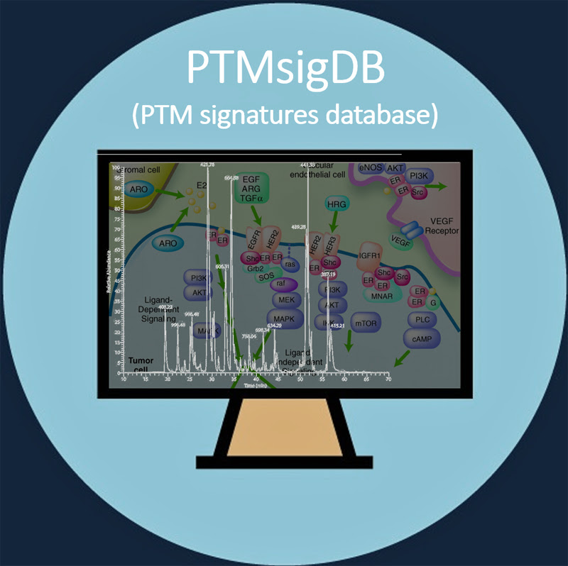

<style type="text/css">
.main-container {
  max-width: 1500px;
  margin-left: auto;
  margin-right: auto;
}
</style>



```{r "init", echo=F, message=F}
options(warn = -1)
library(readxl)
library(knitr)
library(glue)
library(magrittr)
library(shiny)
library(DT)
library(kableExtra)

ver.app <- "v0.0.2"

dat.xlsx <- 'data/PTMsigDB_all_sites_v1.9.1.xlsx'
dat.rds <- sub('\\.xlsx', '.rds', dat.xlsx)

ver <- sub('.*_(v.*)\\.xlsx', '\\1' , dat.xlsx)
org.all <- c('human', 'mouse', 'rat')

file.zip <- glue("db/ptm.sig.db.all.{ver}.zip")
file.xlsx <- dat.xlsx
```


```{r "import", echo=F, message=FALSE}
## import
if(!file.exists(dat.rds)){
  
    dat <- lapply(org.all, function(org)read_excel(dat.xlsx, sheet = org) )
    names(dat) <- org.all
    
    ## add links to psp
    ## NOT WORKING
    # dat <- lapply(dat, function(tab){
    #   x <- apply(tab, 1, function(row) {
    #     grpid <- gsub(' ', '', row['site.psp.grpid'])
    #     row['site.psp.grpid'] <- paste0('<a href="https://www.phosphosite.org/siteAction.action?id=', grpid,'" target="_blank_">',  grpid, '</a>')
    #     row
    #   })
    #   t(x)
    # })
    # 
    ## add links to UniProt
    dat <- lapply(dat, function(tab){
      x <- apply(tab, 1, function(row) {
        site.uniprot <- gsub(' ', '', row['site.uniprot'])
        up.id <- sub(';.*', '', site.uniprot)
        row['site.uniprot'] <- paste0('<a href="https://www.uniprot.org/uniprot/', up.id,'#ptm_processing" target="_blank_">', site.uniprot, '</a>')
        row
      })
      t(x)
    })
    
    ## add links to pubmed
    dat <- lapply(dat, function(tab){
      x <- apply(tab, 1, function(row) {
        anno <- gsub(' ', '', row['site.annotation'])
        anno.gn <- sub('^(.*?)\\:.*', '\\1', anno) 
        anno <- sub('^.*?\\:', '', anno)
        anno <- unlist(strsplit(anno, ';')) %>% as.numeric
        if(sum(is.na(anno)) == 0){
          anno <- sapply(anno, function(pmid) paste0('<a href="https://www.ncbi.nlm.nih.gov/pubmed/', pmid, '" target="_blank_">', pmid, '</a>'))
          anno <- paste(anno.gn, paste0(anno, collapse=';'), sep=':')
          row['site.annotation'] <- anno
        }
        row
      })
      t(x)
    })
    ## add links to WikiPathways
    dat <- lapply(dat, function(tab){
      x <- apply(tab, 1, function(row) {
        anno <- gsub(' ', '', row['site.annotation'])
        anno.gn <- sub('^(.*?)\\:.*', '\\1', anno) 
        wp.id <- sub('.*\\:', '', anno)
        anno <- sub('^.*?\\:', '', anno)
        if(grepl('\\.wikipathways\\.', anno)){
            anno <- paste0('<a href="https://www.wikipathways.org/index.php/Pathway:', wp.id, '" target="_blank_">', wp.id, '</a>')
            anno <- paste(anno.gn, paste0(anno, collapse=';'), sep=':')
          row['site.annotation'] <- anno
          
        }
        row
      })
      t(x)
    })
    
    saveRDS(dat, file=dat.rds)
    
} else {
  dat <- readRDS(dat.rds)
}
```

```{r "zip-db", echo = F, message = F, eval = TRUE}
if(!file.exists(file.zip)){
  zip(file.zip, files=dir('db/', pattern='.gmt$'))
}
```

***

The **PTM signatures database (PTMsigDB)** is a collection of modification site-specific signatures of perturbations, kinase activities and signaling pathways curated from literature. PTMsigDB provides the foundation for site-specific **PTM-signature enrichment analysis (PTM-SEA)** of mass spectrometry derived PTM datasets. Please see [Krug et al. 2019](https://www.mcponline.org/content/18/3/576) for details about the curation process of PTMsigDB and PTM-SEA methodology.

### PTM-SEA

Resources to perform PTM Signature Enrichment analysis (PTM-SEA):

```{r "resource-table", echo=F}
tab <- data.frame(
  resource=c('[ssGSEA2.0/PTM-SEA](https://github.com/broadinstitute/ssGSEA2.0)', '[PTM-SEA-GP](https://tinyurl.com/PTM-SEA-GP)'),
  description=c('GitHub page hosting source code of ssGSEA2.0 and PTM-SEA.', '[GenePattern](http://software.broadinstitute.org/cancer/software/genepattern) module to perform PTM-SEA in a web browser.')
)
kable(tab) %>% kable_styling() 
```


***


### PTMsigDB `r ver`

#### Database stats:


```{r "db-stats", echo=F}
nsignat <- sapply(dat, function(x) length(unique(x[, 'signature'])))
ncat <- sapply(dat, function(x) length(unique( sub('-.*', '', x[, 'category']) )))
nsites <- sapply(dat, function(x) length(unique(x[, 'site.uniprot'])))
nproteins <- sapply(dat, function(x) length( unique( sub(';.*','',x[, 'site.uniprot']) )))
ngenes <- sapply(dat, function(x) length( unique( sub('_.*','',x[, 'site.annotation']) )))
kable( data.frame(no.signatures=nsignat,
                  no.categories=ncat,
                  no.sites=nsites,
                  no.proteins=nproteins,
                  no.genes=ngenes) 
       ) %>% kable_styling(bootstrap_options = "striped", full_width = F)

```

#### PTM signature sets:

Each row in the table below corresponds to a PTM site in a specific PTM signature set. Each site is represented by 1) UniProt + residue number; 2) flanking amino acid sequence (+/- 7 amino acids); 3) PhosphoSitePlus site group ids. Please refer to our [GitHub](https://github.com/broadinstitute/ssGSEA2.0#ptmsigdb) page for more details. The site annotation column lists the corresponding gene symbol as well as additional information depending on the signature category. Links to relevant publications (pmid) or WikiPathway entries can be found in column *site.annotation*.


```{r, echo=F}
source('src/shinyDataTable.R')
shinyApp(
  ui = fluidPage(
    column(12, mainPanel(
      tabsetPanel(
        tabPanel('human', shinyDataTableUI(id='human') ),
        tabPanel('mouse', shinyDataTableUI(id='mouse') ),
        tabPanel('rat', shinyDataTableUI(id='rat') )
        )
    ))
  ),
  server = function(input, output) {
    
    callModule(shinyDataTable, id='human', data=dat[['human']])
    callModule(shinyDataTable, id='mouse', data=dat[['mouse']])
    callModule(shinyDataTable, id='rat', data=dat[['rat']])
    },
options = list(height = 750, width=2000)
)
```

***

### Downloads

PTMsigDB signature sets curated for human, mouse and rat can be downloaded below. The zip file contains a total of nine [GMT](https://software.broadinstitute.org/cancer/software/gsea/wiki/index.php/Data_formats#GMT:_Gene_Matrix_Transposed_file_format_.28.2A.gmt.29) files corresponding to three database formats (uniprot, flanking sequence, site group ids) curated for three organims (human, mouse, rat). The Excel file is a representation of the table above. Version v1.8.1 was the initial release of PTMsigDB as described in [Krug et al. 2019](https://www.mcponline.org/content/18/3/576). The v1.8.1 Excel file corresponds to Supplemental Table 1 accompanying the manuscript.


<table>
<tr>
<th>zip</th><th>xlsx</th><th>version</th><th>date</th>
</tr>

<!---v1.9.1--->
<tr>
<td>
```{r, echo=F}
shinyApp(
  ui=fluidPage(fluidRow(downloadLink('download.zip', label = glue("gmt/zip")))),
  server=function(input, output, session){
  output$download.zip <- downloadHandler(filename=function(){file.zip},
       content = function(file){file.copy( file.zip, file)}, contentType = "application/zip"
    )
  }, options = list(height = 20)
)
```
</td>
<td>
```{r, echo=F}
shinyApp(
  ui=fluidPage(fluidRow(downloadLink('download.xlsx', label = glue("xlsx")))),
  server=function(input, output, session){
  output$download.xlsx <- downloadHandler(filename=function(){file.xlsx},
       content = function(file){file.copy( file.xlsx, file)}, contentType = "application/xlsx"
    )
  }, options = list(height = 20)
)
```
</td>
<td>`r ver`</td>
<td>2020-10-20</td>
</tr>

<!---v1.9.0--->
<tr>
<td>
```{r, echo=F}
file.zip.v1.9.0 <- glue("db/ptm.sig.db.all.v1.9.0.zip")
shinyApp(
  ui=fluidPage(fluidRow(downloadLink('download.zip.v1.9.0' , label = glue("gmt/zip")))),
  server=function(input, output, session){
  output$download.zip.v1.9.0 <- downloadHandler(filename=function(){file.zip.v1.9.0},
       content = function(file){file.copy( file.zip.v1.9.0, file)}, contentType = "application/zip"
    )
  }, options = list(height = 20)
)
```
</td>
<td>
```{r, echo=F}
file.xlsx.v1.9.0 <- glue("data/PTMsigDB_all_sites_v1.9.0.xlsx")
shinyApp(
  ui=fluidPage(fluidRow(downloadLink('download.xlsx.v1.9.0', label = glue("xlsx")))),
  server=function(input, output, session){
  output$download.xlsx.v1.9.0  <- downloadHandler(filename=function(){file.xlsx.v1.9.0 },
       content = function(file){file.copy( file.xlsx.v1.9.0 , file)}, contentType = "application/xlsx"
    )
  }, options = list(height = 20)
)
```
</td>
<td>v1.9.0</td>
<td>2019-03-18</td>
</tr>

<!---v1.8.1--->
<tr>
<td>
```{r, echo=F}
file.zip.v1.8.1 <- glue("db/ptm.sig.db.all.v1.8.1.zip")
shinyApp(
  ui=fluidPage(fluidRow(downloadLink('download.zip.v1.8.1', label = glue("gmt/zip")))),
  server=function(input, output, session){
  output$download.zip.v1.8.1 <- downloadHandler(filename=function(){file.zip.v1.8.1},
       content = function(file){file.copy( file.zip.v1.8.1, file)}, contentType = "application/zip"
    )
  }, options = list(height = 20)
)
```
</td>
<td>
```{r, echo=F}
file.xlsx.v1.8.1 <- glue("data/PTMsigDB_all_sites_v1.8.1.xlsx")
shinyApp(
  ui=fluidPage(fluidRow(downloadLink('download.xlsx.v1.8.1', label = glue("xlsx (Supplemental Table 1)")))),
  server=function(input, output, session){
  output$download.xlsx.v1.8.1 <- downloadHandler(filename=function(){file.xlsx.v1.8.1},
       content = function(file){file.copy( file.xlsx.v1.8.1, file)}, contentType = "application/xlsx"
    )
  }, options = list(height = 20)
)
```
</td>
<td>v1.8.1</td>
<td>2018-12-18</td>
</tr>
</table>


</table>

***

<p>
<table width="100%">
<tr>
<td align="left">ptmsigdb-app `r ver.app`</td>
<td align="right"><b>[Proteomics Platform@Broad](https://www.broadinstitute.org/proteomics)</b></td>
</tr>
</table>
</p>

